--- 
title: Digital Pedagogy in the Humanities
subtitle: Concepts, Models, and Experiments 
chapter: Visualization
URL: keywords/visualization.md
authors: 
- family: Sinclair
given: Stéfan
- family: Rockwell
given: Geoffrey
editor: 
- family: Gold
given: Matthew
publisher: Modern Language Association
type: book
---

# Visualization (Draft)

## Stéfan Sinclair

McGill University | [stefansinclair.name](http://stefansinclair.name)

## Geoffrey Rockwell

University of Alberta | [geoffreyrockwell.com](http://geoffreyrockwell.com)

---

##### Publication Status:
* **unreviewed draft**
* draft version undergoing editorial review
* draft version undergoing peer-to-peer review https://digitalpedagogy.commons.mla.org/
* published 

--- 

## CURATORIAL STATEMENT 

Although for many humanities disciplines (literature, history, philosophy, etc.) text tends to be the dominant currency for apprehending and expressing knowledge, data visualizations have a long history and much to offer, particularly when the amount of text exceeds what can be reasonably read and represented by more traditional means. As is argued in two of the artifacts below ("Information Visualization for Humanities Scholars" and "Humanities Approaches to Graphical Display"), interactive visualizations can be a valuable way of interpreting evidence and sharing those interpretations. Further, sharing interactive visualizations allows other to explore evidence and come to their own conclusions.

Given the proliferation of visualizations in online media, especially for exploring big data, it has become important to teach students to treat them critically. Moreover, we find that having students create their own interactive visualizations is an effective way of having them leverage their humanities background to engage with a variety of contemporary issues, from the environment to various social inequalities. Visualizations are an eminently shareable form of communication and students are empowered to join public discourses, especially via social media.

In a pedagogical context we tend to approach visualization with two distinct but interrelated questions:

1. **Literacy**: How can we be better informed and more critical consumers of visualizations? What is the history of different genres of visualization? Visualizations are everywhere, do we notice them? What are visualizations showing us and what are they hiding? What are some of the common pitfalls of visualizations?
2. **Rhetoric**: How can we be producers of effective visualizations? Can we imagine new ways of using visualization in humanistic interpretation? What traditions of interpreting visualization do we work with?

These two sets of question, how we read (literacy) and how we express (rhetoric) can develop symbiotically, we can better understand visualizations when we've had the experience of creating them and in modelling we can better understand what other designers were trying to do. That's why we tend to design our teaching on data visualization in a cross-over pattern: we emphasize theoretical work and exploration of existing data visualizations early on while ramping-up creative practice as the term progresses.

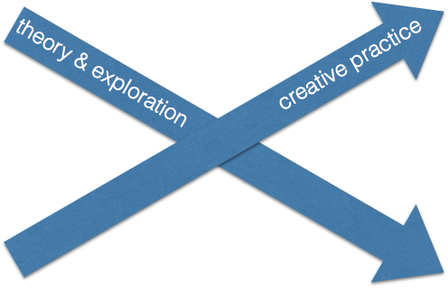

Within the practice stream we also progress from using relatively simple tools (like [Infogr.am](https://infogr.am/) and [Voyant](https://voyant-tools.org) to adapting the data, code and styling of [D3 visualizations](https://d3js.org/), using [RAW](http://raw.densitydesign.org/) as a bridge.

## CURATED ARTIFACTS 

### “What is Visualization?”

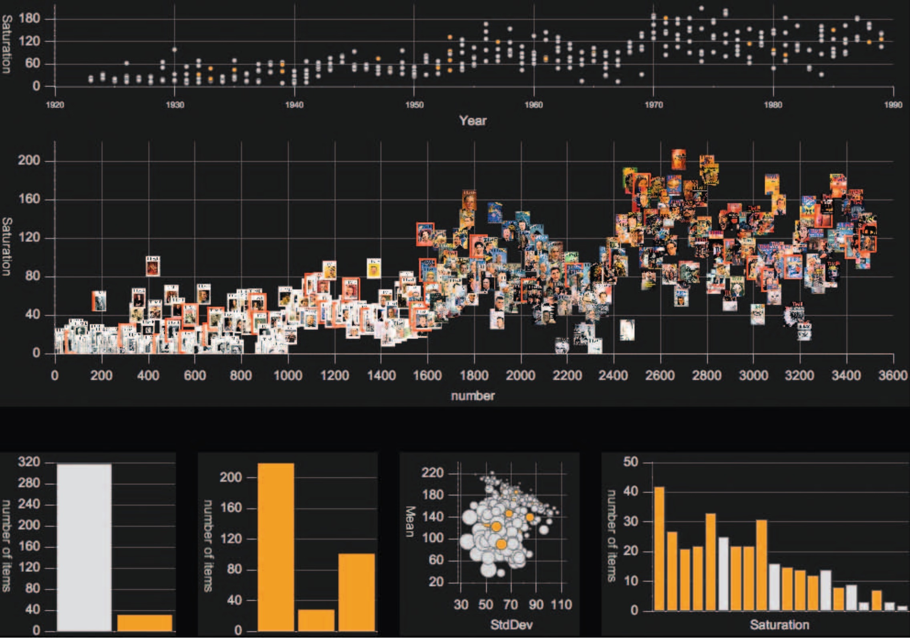

* Artifact Type: Open access online journal article
* Source: https://publishup.uni-potsdam.de/opus4-ubp/files/5047/digarec06_S116_156.pdf
* Creator and Affiliation: Lev Manovich (CUNY)

This article provides a useful on-ramp for defining some aspects of information visualization, or *infovis* as it is commonly abbreviated. Manovich situates infovis in relation to other fields such as scientific visualization and information design, while also recognizing that the distinctions are sometimes fuzzy. Two core principles of information visualization are discussed in more depth: 1) *reduction* (ignoring details of individual items in favour of representing patterns from a subset of characteristics); and 2) *spaciality* (using variables such as position, size, shape, and movement). Manovich argues that the explosive development of computer graphics during the past two decades has enabled visualization without reduction, or what he calls "direct" or "media" visualization: items individual items are represented in some recognizable form instead of abstract representations like dots on a graph.

We ask students to navigate through several galleries of visualizations (see "Related Materials") and identify 5 examples of direct visualizations while thinking about the advantages and disadvantages of this technique.
 
### “Humanities Approaches to Graphical Display”

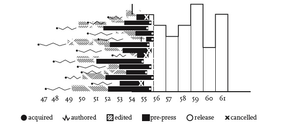

* Artifact Type: Open access online journal article
* Source: http://www.digitalhumanities.org/dhq/vol/5/1/000091/000091.html
* Creator and Affiliation: Johanna Drucker (UCLA)

Johanna Drucker's article is an excellent way of framing epistemological issues of visualization in the humanities. She urges us to rethink the notion of *data* as what is given and instead think of *capta* as what is taken and constructed. Drucker argues that this move will lead us to forms of graphical expression that are more nuanced and truer to humanistic perspectives on knowledge. By providing examples of how to reconceptualize visualizations such as bar charts, timelines, and maps, Drucker shows how every aspect of visualization is subject to interpretation, even though most visualizations mask the uncertainty and the decision-making processes.

In discussing this article it may be useful to provide some philosophical context for subjectivity and epistemology, especially with respect to cultural interpretation. A useful exercise is to provide students a conventional example of data visualization and have them imagine how it might be reworked to expose how the interpretative act of visualization -- how the data was captured, manipulated, by who and for who.

### "Information Visualization for Humanities Scholars"

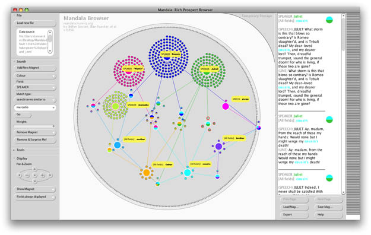

* Artifact Type: Open access online journal article
* Source URL: https://dlsanthology.commons.mla.org/information-visualization-for-humanities-scholars/
* Creator and Affiliation: Stéfan Sinclair, Stan Ruecker, and Milena Radzikowska

This article explores information visualization for the specific purposes of humanities scholarship. Given that the humanities value original and persuasive arguments, we can assess the value of individual visualizations by determining how well they promote the proliferation of perspectives. This is partly why interactive interfaces can be so enriching for humanities scholarship: they're conducive to exploration and co-creation. Based largely on the authors' visualization prototyping work, the article reviews a range of visualization archetypes including 1) Browsing by Grouping; 2) Revealing Features; Time and Space; Typographic Form; and Interactive Glyphs. The article focuses on humanities scholarship, it can be interesting to ask students to think through how applicable the article is to other disciplines and/or outside of academia.

### “Visualizing Information for Advocacy”

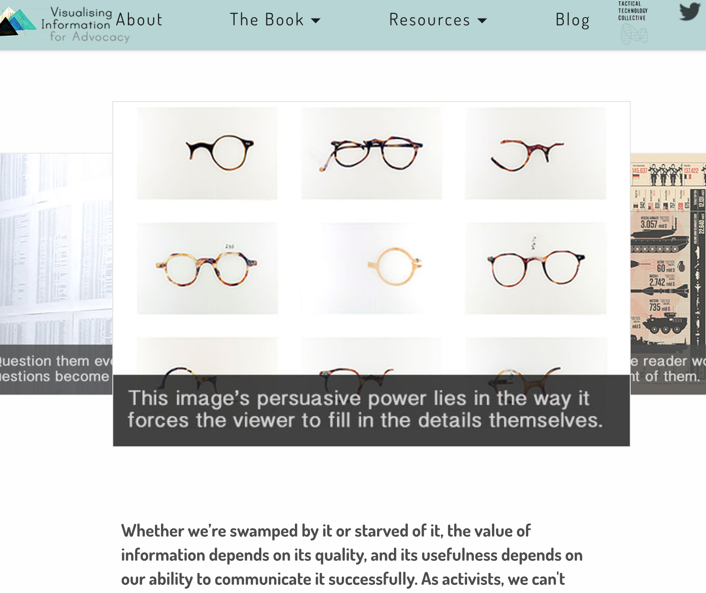

* Artifact Type: Website including open access book
* Source: http://visualisingadvocacy.org/
* Creators: Maya Indira Ganesh, Stephanie Hankey, Tom Longley and Marek Tuszynski

This is a rich website that provides a wide range of resources from guidance on [working with data](http://visualisingadvocacy.org/working-data) to a list of [visualization tools](http://visualisingadvocacy.org/resources/visualisationtools). There is also an [open access book](http://visualisingadvocacy.org/getbook) that discusses visual rhetoric and -- based on several case studies -- guides the reader through the stages of a project from getting an idea and constructing a dataset to developing a visualization and disseminating it. Though the book may not place as much emphasis on interpretation as Drucker (see previous item), it does insist on creativity, rhetoric, and audiences. We also appreciate how it bridges visual information design and activism in ways that will resonate with anyone interested in the public humanities. We typically ask students to read the book while starting a list of possible social causes that could interest them for a course project.

### “The Ethics of Visualization”

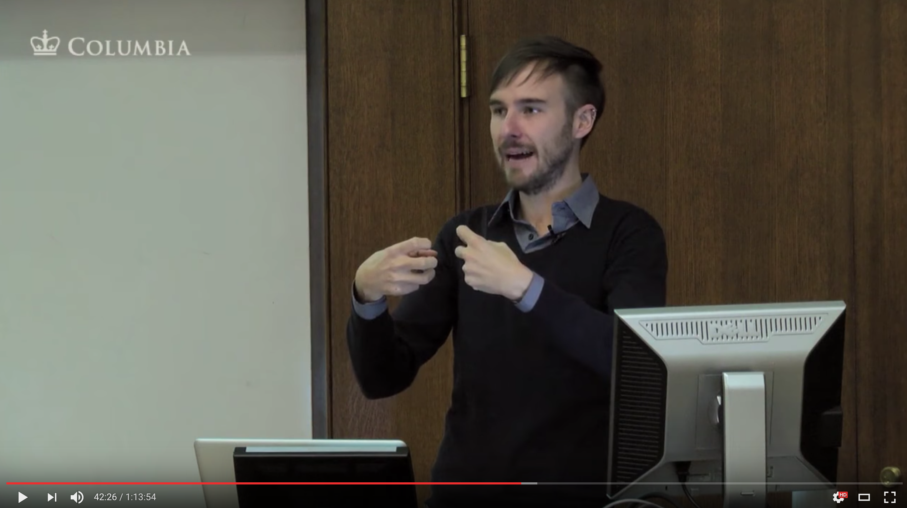

* Artifact Type: Video
* Source URL: https://www.youtube.com/watch?v=tL7amXznq4A
* Creator and Affiliation: Chris Alen Sula

This is a video of a talk given by Chris Alen Sula that starts with a brief but useful history of visualization.  He makes the point that ethics aren't often addressed in discussions of visualization, especially in the academic context. Sula proposes that useful groundwork for an ethics of visualization can be provided by 1) speech act theory, 2) role-based morality, and most powerfully 3) general ethics frameworks. The talk unpacks each of these and provides several useful perspectives for thinking about the ethics of visualization, particularly in the context of the Digital Humanities.

### “Studies in Communication and Culture: Data”

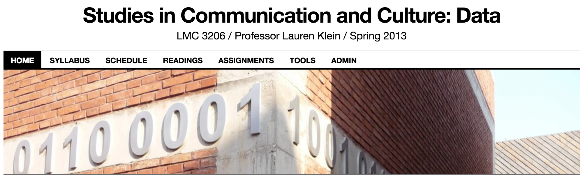

* Artifact Type: Course syllabus
* Source URL: http://lkleincourses.lmc.gatech.edu/data13/schedule/
* Creator and Affiliation: Lauren Klein (Georgia Tech)

Though not solely on visualization, Lauren Klein's syllabus touches on a many essential topics related to uses of data in the digital humanities. Several topics explore the relationship between facts and data, there's an overview of major kinds of visualization, and she addresses cultural and social issues that arise from data (from art to surveillance). Interspersed with the academic readings are several excerpts of fiction, such as *Minority Report*, *The Matrix*, and *Gattaca*.

Klein has also explored the way the history of visualization has been presented and alternative histories. A [talk she gave to the 3DH project is here](https://lecture2go.uni-hamburg.de/l2go/-/get/v/19629) where she talked about the [Speculative Designs project](http://dhlab.lmc.gatech.edu/speculative-designs/) which is recovering the work of Elizabeth Peabody. There is a prototype that lets students build Peabody mural charts. This project creates a context for discussing the stories told about visualization.

### “Infogr.am”

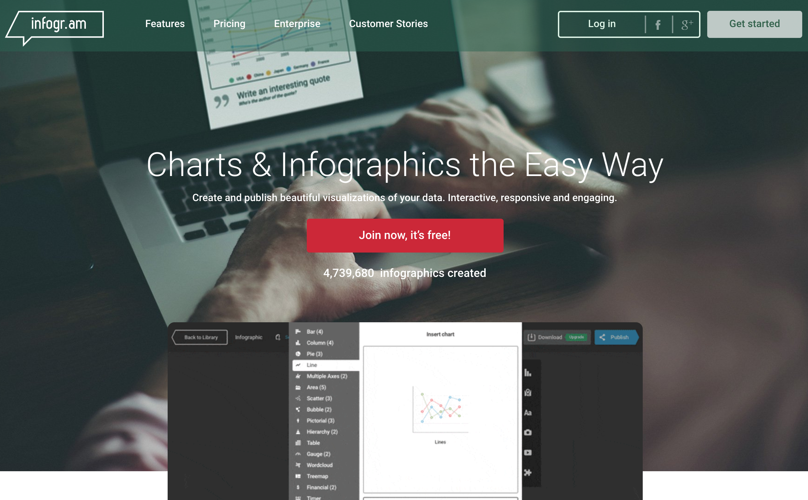

* Artifact Type: Web application
* Source URL: https://infogr.am/
* Creator and Affiliation: Infogr.am

Infogr.am is a web-based application that makes it relatively easy to experiment with creating interactive charts and infographics that can be published or embedded in another web page. There are over 35 chart types, including the usual suspects (bar, line, pie, scatter, bubble, wordcloud, treemap, candlestick, etc.). We especially like the pictorial charts for infographics. There's also powerful mapping functionality that geocodes named locations (a place like "Montreal" is converted to latitude and longitude coordinates).

We usually introduce infographics by discussing the rhetorical style of ["The Humanities Matter!" infographic](http://4humanities.org/2013/07/the-humanities-matter-infographic/) and then ask students to experiment with storytelling in Infogr.am using several different charts and maps, on a topic of their choice. The free version of Infogr.am is usually sufficient for the purposes of creating simple infographics.

### “RAW”

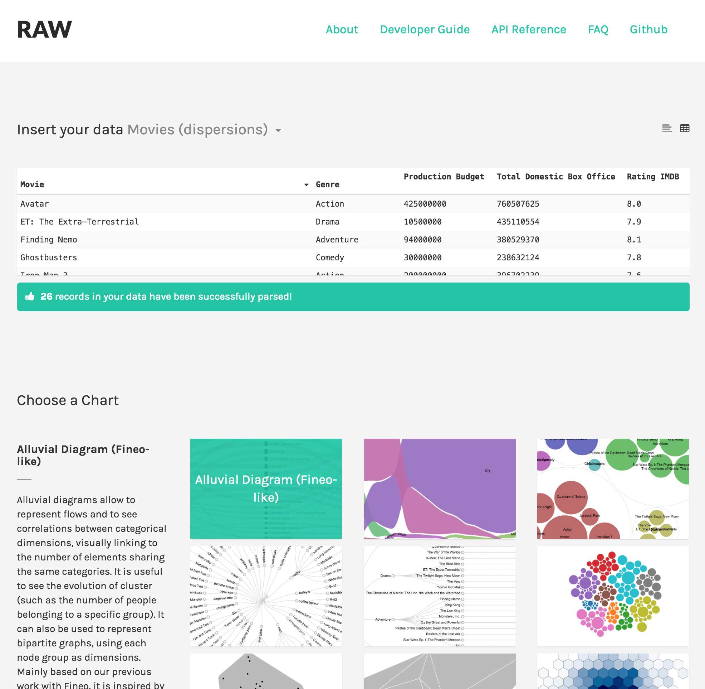

* Artifact Type: Web application
* Source URL: http://raw.densitydesign.org/
* Creator and Affiliation: DensityDesign Lab (Giorgio Caviglia, Giorgio Uboldi, Matteo Azzi, Michele Mauri)

RAW says in its tagline that it is "The missing link between spreadsheets and vector graphics". It may not be the only missing link out there, but it certainly is powerful and user-friendly. Students can choose from one of the sample datasets (cars, movies, music, cocktails), or copy and paste data from their own spreadsheet. Next students can choose from one of 16 interesting chart types and customize which data column should be used for structure, colour, size and other chart dimensions.

RAW provides ample opportunity for students to think about the nature and format of different datasets, the rhetorical baggage of different genres of visualization, and how different visualizations with different options can show the same data very differently. RAW is also an excellent on-ramp for [web-based D3 visualizations](https://d3js.org/).

### “Voyant Tools”

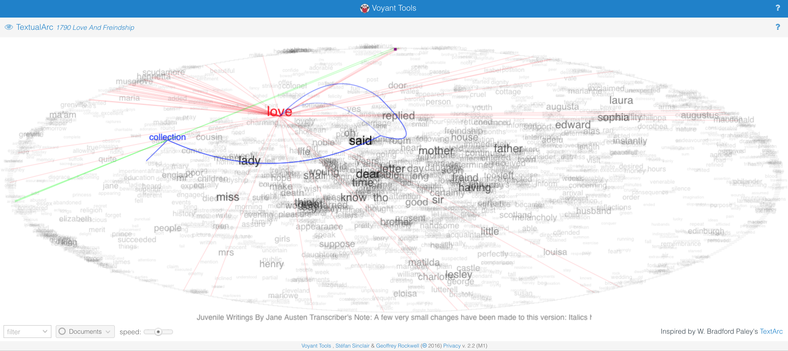

* Artifact Type: Web application
* Source URL: https://voyant-tools.org
* Creator and Affiliation: Stéfan Sinclair & Geoffrey Rockwell

Voyant Tools is a web-based text analysis and visualization environment. One of its strengths is in moving quickly from one or more text documents to a wide variety of tools and visualizations for interpretation. Some of the visualizations are more common (like the [Cirrus](https://voyant-tools.org/docs/#!/guide/cirrus) word cloud or the [Trends](https://voyant-tools.org/docs/#!/guide/trends) line chart of terms) while others are more unusual and playful (like [Knots](http://voyant-tools.org/docs/#!/guide/knots) or [TextualArc](https://voyant-tools.org/docs/#!/guide/textualarc) inspired by the classic [TextArc](https://textarc.org/) by Bradford Paley).

Voyant Tools can suggest ways of visualizing data when you start with unstructured text (i.e. not tabular data). We ask students to skim through the [full list of tools](https://voyant-tools.org/docs/#!/guide/tools) and then to explore Voyant with a corpus of their own essays to see if they can discover unsuspected characteristics of their writing.  It also can be used to show how different visualizations can interact in different views that combine tools.

### BatchGeo

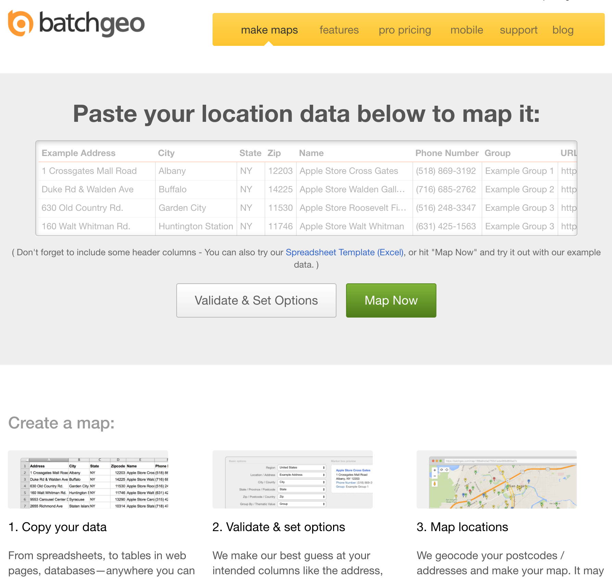

* Artifact Type: Web application
* Source URL: https://batchgeo.com/

BatchGeo is a user-friendly and free resource for experimenting with mapping geographical data. The user can add tabular data (by uploading a spreadsheet or pasting rows into a box), define relevant columns and generate an interactive map. One of the more useful features of BatchGeo is that it tries to automatically resolve addresses and locations to geographical coordinates (though it's worth pointing out the limitations of such automation and the potential for ambiguity and errors). Generated maps can be shared by URL and embedded in web pages. Students could be encouraged to look for local sources of [open data](https://en.wikipedia.org/wiki/Open_data) or search through one of many dataset portals such as [Datahub](https://datahub.io/).

## RELATED MATERIALS

Below is a list of visualization galleries. We find that having students travel through the galleries is a good way of familiarizing thems with the variety of data visualizations out there (even if the vast majority have little to do with humanities scholarship). We ask students to compile an annotated set of their favourites, which can often be a source of inspiration for their own work.

* [Milestones in the History of Thematic Cartography, Statistical Graphics and Data Visualization](http://www.datavis.ca/milestones/)
* [Datavisualization.ch](http://selection.datavisualization.ch/)
* [D3 Gallery](https://github.com/d3/d3/wiki/Gallery)
* [Information Aesthetics](http://infosthetics.com/)
* [Information is Beautiful](http://www.informationisbeautiful.net/)
* [Visual Complexity](http://www.visualcomplexity.com/vc/)

## WORKS CITED
